Title: [Functional Programming Principles in Scala] Lec2: Higher Order Functions 
Date: 2016-06-23   
Slug:  progfun1_lec2_highorder_func  
Tags: scala   
 
 
>This week, we'll learn about functions as first-class values, and higher order functions. We'll also learn about Scala's syntax and how it's formally defined. Finally, we'll learn about methods, classes, and data abstraction through the design of a data structure for rational numbers. 
 
2.1 - Higher-Order Functions 
---------------------------- 
higher order functions: functions that takes functions as parameter or returns functions.  
 
example:  
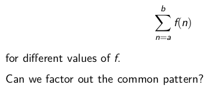 
⇒ put the ``f`` as a parameter 
 
	def sum(f:Int => Int, a: Int, b: Int):Int = { 
	  if(a>b) 0 
	  else f(a) + sum(f, a+1, b) 
	} 
 
 
### function types 
``A => B`` is a function that takes ``A`` as parameter and returns ``B``. 
 
### Anonymous functions 
"literals" for functions, syntactic sugar. 
ex.   
 
``(x: Int, y: Int) => x+y`` 
``(x: Int) => x*x`` 
 
use anon functions in previous ``sum()`` function:  
 
	sum(x=>x, 1, 10) 
	sum(x=>x*x, 1, 10) 
 
exercice: turn ``sum()`` into tailrec fashion. 
 
	def sum2(f:Int => Int, a: Int, b: Int):Int = { 
	  @tailrec 
	  def sumTR(a: Int, acc: Int): Int = { 
	    if (a > b) acc 
	    else sumTR(a + 1, acc + f(a)) 
	  } 
	  sumTR(a, 0) 
	} 
 
(note: using namescoping to eliminate parameters in inner functions) 
 
2.2 - Currying 
-------------- 
 
define a function that *returns  a funtion* 
 
	def sum3(f:Int => Int): (Int, Int)=>Int = { 
	  def sumF(a:Int, b:Int):Int = { 
	    if(a>b) 0 
	    else f(a) + sum3(f, a+1, b) 
	  } 
	  sumF 
	} 
 
 
when calling this function:  
``sum3(cube)(1,10)`` 
 
syntactic sugar: shorter version of functions that return functions: 
 
	def sum3(f:Int => Int)(a:Int, b:Int):Int = { 
	    if(a>b) 0 
	    else f(a) + sum3(f)(a+1, b) 
	} 
 
question: what is type of ``sum3``? 
→ ``Int => Int => (Int, Int) => Int`` 
note: functional types are *associated to the right*,  
``Int => Int => Int`` is equivalent to ``Int => (Int => Int)`` 
 
### "currying" 
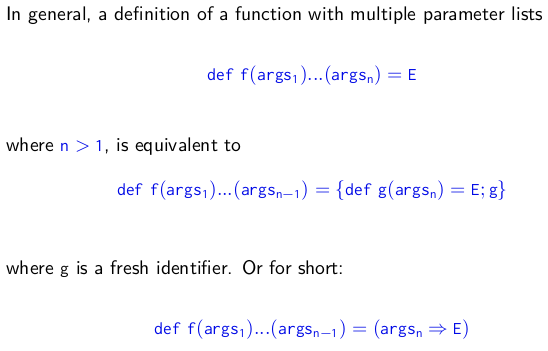 
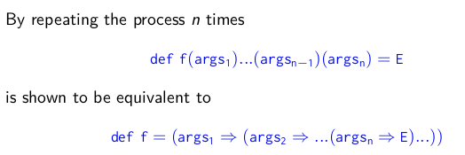 
 
exercice:  
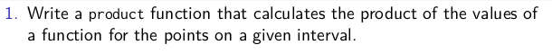 
 
	def product(f: Int => Int)(a: Int, b: Int): Int = { 
	  if (a > b) 1 
	  else a * product(f)(a + 1, b) 
	} 
	product(x=>x)(1,10) 
 
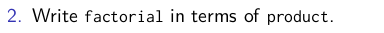 
 
	def fact(n:Int) = product(x=>x)(1,n) 
	fact(10) 
 
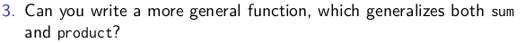 
	def more_general(op: (Int,Int) => Int, default: Int) 
	                (f: Int=> Int)(a:Int, b:Int):Int = { 
	  if(a>b) default 
	  else op(a, more_general(op, default)(f)(a + 1, b)) 
	} 
	more_general((x,y)=>x+y, 0)(x=>x)(1,10) 
 
老师的解法:  
	def map_reduce(f:Int=> Int, op:(Int, Int)=>Int, default:Int) 
	              (a:Int, b:Int):Int = { 
	  if(a>b) default 
	  else op(f(a), map_reduce(f, op, default)(a+1,b)) 
	} 
	def factorial2(n:Int):Int = map_reduce(x=>x, (a,b)=> a*b, 1)(1,n) 
	factorial2(10) 
 
 
2.3 - Example: Finding Fixed Points 
----------------------------------- 
find the fix point of a function: x = f(x) 
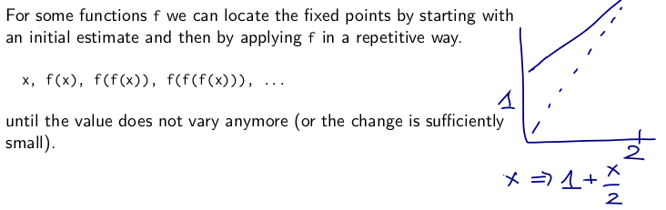 
 
	val tol = 0.001 
	def isCloseEnough(x:Double, y:Double):Boolean = 
	  math.abs((x-y)/x)<tol 
	def fixedPoint(f: Double=>Double)(firstGuess:Double):Double = { 
	  def iterate(guess:Double):Double = { 
	    if(isCloseEnough(guess, f(guess))) guess 
	    else iterate(f(guess)) 
	  } 
	  iterate(firstGuess) 
	} 
	fixedPoint(x=>1+x/2)(1) 
 
 
using the fixepoint function for ``sqrt``: 
 
* sqrt(x) = y such that: x=y*y 
* =y such that y = x/y 
* =*fixed point for the function f(y)=x/y* 
 
 
	def sqrt(x:Double):Double = fixedPoint(y=>x/y)(1) 
	sqrt(2) 
 
 
⇒ doesn't converge! ⇒ guess oscillates between 1 and 2... 
average damping: prevent the estimate from varying to much. 
⇒  *by taking the average of successive values* 
 
``def sqrt2(x: Double): Double = fixedPoint(y => (y + x / y) / 2)(1)`` 
 
abstract this damping technique: 
 
	def avgDamping(f:Double=> Double)(x:Double):Double = 
	  (f(x)+x)/2 
	def sqrt2(x: Double): Double = fixedPoint(avgDamping(y=>x/y))(1) 
 
 
summary: The highest level of abstraction is not always the best, but it is important to know the techniques of abstraction, so as to use them when appropriate. 
 
2.4 - Scala Syntax Summary 
-------------------------- 
notations(EBNF): 
 
* ``|`` denotes an alternative 
* ``[...]`` an option (0 or 1) 
* ``{...}`` a repetition (0 or more) 
 
 
**Types** 
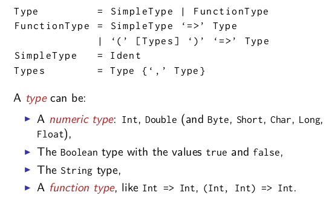 
 
**Expressions** 
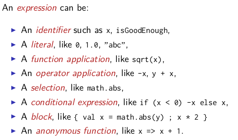 
 
**Definitions** 
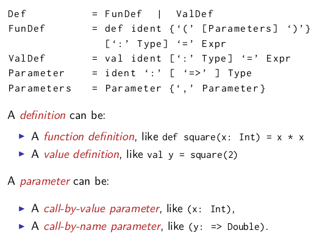 
 
2.5 - Functions and Data 
------------------------ 
example. *rational numbers* (x/y) 
define a class:  
 
	class Rational(x:Int, y:Int){ 
	  def numer = x 
	  def denom = y 
	} 
	val x = new Rational(1,2) 
	x.numer 
	x.denom 
 
this definition creates both a class and the constructor.  
now implement arithmetic: 
 
	 
	def add(that: Rational) = 
	  new Rational(numer * that.denom + denom * that.numer, that.denom * denom) 
	 
	def neg = new Rational(-numer, denom) 
	 
	def sub(that: Rational) = 
	  add(that.neg) 
	 
	override def toString = numer + "/" + denom 
 
 
2.6 - More Fun With Rationals 
----------------------------- 
 
simplify the rationals *at construction*:  add private members:  
 
	private def gcd(a: Int, b: Int): Int = if (b == 0) a else gcd(b, a % b) 
	private val g = gcd(x, y) 
	def numer = x/g 
	def denom = y/g 
 
other options:  
 
* replace ``g`` with ``gcd(x,y)`` 
* turn ``numer`` and ``denom`` into ``val`` 
 
 
add less and max function:  
 
	def less(that:Rational) = 
	  this.numer*that.denom < this.denom*that.numer 
	 
	def max(that:Rational) = if(this.less(that)) that else this 
 
 
### preconditions 
ex: avoid divide by 0.  
 
``require(y!=0, "denominator must be non zero")`` 
 
→ *java.lang.IllegalArgumentException: requirement failed: denominator must be non zero* 
 
``require ``is a test to perform when the class is initialized.  
similar: ``assert()`` 
 
### constructor 
in scala a class implicitly introduces a **primary constructor:** 
 
* *takes parameters of the class* 
* *executes all statements in the class body* 
 
 
to add another constructor: 
 
``def this(x:Int) = this(x,1)`` 
 
exercice:  
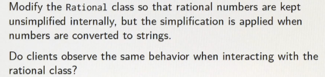 
 
	override def toString = { 
	  val g = gcd(numer, denom) 
	  numer/g + "/" + denom/g 
	} 
 
 
2.7 - Evaluation and Operators 
------------------------------ 
 
evaluation for class/object 
--------------------------- 
extend the substitution model to classes and objects 
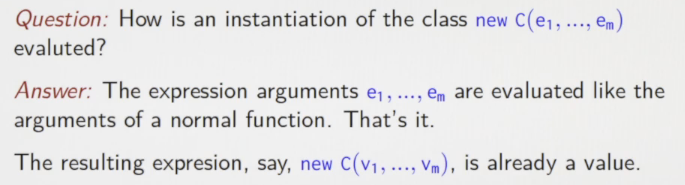 
 
 
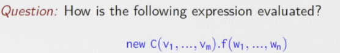 
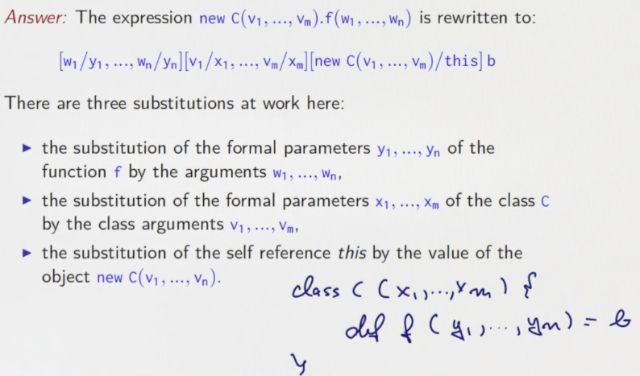 
 
examples:  
 
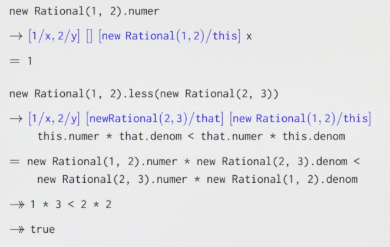 
 
operator overloading 
-------------------- 
 
### infix ops 
**any method with one parameter can be used as an infix operator.** 
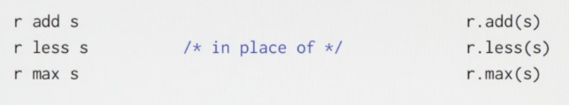 
 
*scala identifiers can bu symbolic:* 
 
 
⇒ change names to ``+, <, -,`` use in this way: 
 
	x + y 
	x < y 
	x max y 
	x - y - z 
 
 
### unitary ops 
now change the ``neg`` method: prefix operator, and might be confused with the sub(``-``) 
⇒ it's name is special: ``unary_-`` 
 
``def unary_- = new Rational(-numer, denom)`` 
 
### precedence of ops 
**the precedence of an op is defined by its first letter** 
order (by increasing precedence): 
 
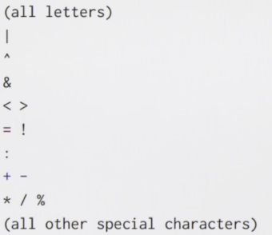 
quite the same as in java 
 
 
Programming Assignment: Functional Sets 
--------------------------------------- 
>Mathematically, we call the function which takes an integer as argument and which returns a boolean indicating whether the given integer belongs to a set, the characteristic function of the set. For example, we can characterize the set of negative integers by the characteristic function (x: Int) => x < 0. 
 
>Therefore, we choose to represent a set by its characterisitc function and define a type alias for this representation: 
 
	type Set = Int => Boolean 
	def contains(s: Set, elem: Int): Boolean = s(elem) 
