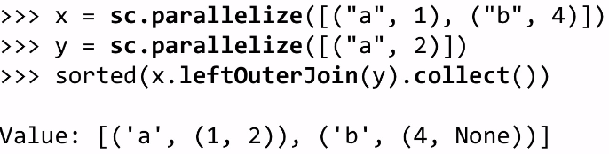

Title: [Spark MOOC note] Lec6. Structured Data
Date: 2015-06-17
Slug: sparkmooc_note_lec6
Tags: spark

RELATIONAL DATABASE
-------------------
review: key data management concepts:

* data model 
* schema
* *relational data model*


structured data: have a specific schema to start with

relationl database: a set of relations.
2 parts to a Relation: 

* schema: name of relation, name and type of columns


* instance: 

any data at given time 
(*cardinality*:=nb of rows, *degree*:=nb of fields)
	

LARGE DATABASES
---------------

RELATIONAL DATABASE EXAMPLE AND DISCUSSION
------------------------------------------
   
cardinality=3
degree=5

advantages of Relational Databases:

* well-def structure
* maintain indices for high performance
* consistancy maintained by transactions


disadvantages: 

* limited, rigid structure
* most disk space taken by large indices
* transactions are slow
* poor support for *sparse data*(which is common)


STRUCTURED QUERY LANGUAGE (SQL)
-------------------------------
supported by **DataFrame** of pyspark   


JOINS IN SQL
------------

cross join: carteian product

EXPLICIT SQL JOINS
------------------

explicit version is preferred

TYPES OF SQL JOINS
------------------
⇒ controls how *unmatched* keys are handled

LEFT OUTER JOIN: 
keys appearring in left table but not in right table will be included with NULL as value

JOINS IN SPARK
--------------

* for spark DataFrame: support inner/left outer/semi-join
* for *pair RDDs*: support inner join(), leftOuterJoin(), fullOuterJoin()

join ex:

	

	
outerjoin ex:

	
fullouterjoin ex:

	


Lab 2 - Web Server Log Analysis with Apache Spark
-------------------------------------------------
 Apache Common Log Format (CLF):  
``127.0.0.1 - - [01/Aug/1995:00:00:01 -0400] "GET /images/launch-logo.gif HTTP/1.0" 200 1839``

```Row(
host          = match.group(1),
client_identd = match.group(2),
user_id       = match.group(3),
date_time     = parse_apache_time(match.group(4)),
method        = match.group(5),
endpoint      = match.group(6),
protocol      = match.group(7),
response_code = int(match.group(8)),
content_size  = size 
)```
	

* distinctByKey

一个pair RDD按照key来distinct不知道有没有distinctByKey之类的东西, 只好写成这样, 不知是不是对的: 
``dayHostCount = dayGroupedHosts.map(lambda group : (group[0], len(set(group[1])) ) )``

...总体来说很有意思的一个lab...
