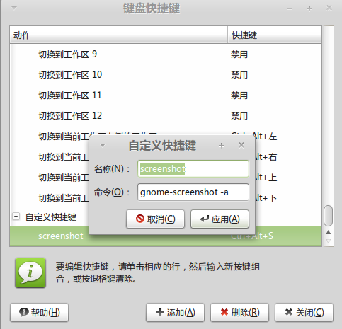

Title: 把抓图工具关联到ubuntu快捷键
Date: 2012-01-10
Slug: scrshot-shortcut
Tags: tips, 快捷键

终端输入gnome-screenshot --help, 发现选项"-a"表示的是抓取一部分屏幕.

于是打开编辑键盘快捷键窗口, 新建一个快捷键如下图:

这样, 按下Ctrl+Alt+s快捷键后即可启动抓图, 且是抓取一个区域. 不过不知为什么, 反应比较慢, 需要按下一段时间  (一秒钟?)才会有反应.

**02/23/2012续:**
安装了lucid之后不好使了!
症状就是, 参数-a不起作用, 按下快捷键后直接出来桌面截图, 如果一直按着的话会出来选取区域的, 但是此时已经把桌面截了N次了!.... 无语啊!

上网搜了好久,终于在[奶牛的博客](http://www.nenew.net/ubuntu-linux-gnome-screenshot-area.html)里看见了方法: 命令参数变成 -ai, 这样每次按下快捷键后会先弹出来交互界面... 也罢...

我非常无语...

嗯 就这样吧~...

**--imported from zim**

