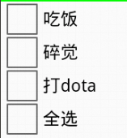
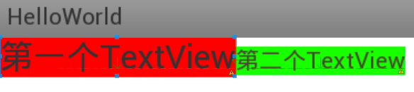

Title: android开发视频教程(重制版) 第一季 课程笔记
Slug: android开发教程第一季笔记
Date: 2013-07-31
Tags: android

S01E02: 开发环境搭建
==============

* 直接去 developer.android.com/sdk/ 下载bundle解压即可, 里面包含eclipse
* 新建一个模拟器: 内部存储一般64MB足矣:

S01E03: android项目目录结构
=====================

#### 第一个android程序
new-->android application

#### 目录结构

* com.example.helloworld这个包名一般为网址倒着写, android是按照包名来区分不同APP的
* src/目录下存放java程序
* gen/目录下存放系统自动生成的文件, R.java里给每一个控件或变量赋予一个id, 千万__不要手动修改R,.java内容__!!
* assets/目录下和res/目录下都可以放各种外部文件(ex. 图片), 但是assets下的文件不会在R.java中生成id
* res/layout/ 存放布局文件(xml格式)
* AndroidManifest.xml用于统筹

S01E04: 技术结构
============

#### 四层结构图
开发位于最上层application

#### 基于组件的应用程序开发
搭积木

#### 常见组件

* activity(负责用户交互); 
* service(后台处理数据); 
* Content Provider(对外提供数据); 
* BroadcastReceiver(接收broadcast)

S01E05: activity初步
==================

#### Activity启动基本流程

* AndroidManifest.xml里面指定, 程序运行后执行MainActivity.java
* MainActivity.java的onCreate()函数里setContentView(R.layout.activity_main); 读取activity_main.xml文件并显示

#### Activity与布局文件
一一对应 (eclipse编辑器里有图形化预览界面)

#### 在Activity当中获取代表控件对象

* 首先在activity_main.xml里定义控件时, 为其指定一个id: 

    android:id="@+id/textView1"  ("+id"表示新建一个id)

* → 自动在R.java里生成一个id:

    public static final class id {
            public static final int textView1=0x7f080003;
        }

* → 之后在MainActivity.java里, 先声明成员变量:

private TextView tv

* → 在onCreate()中, 通过id获得这个控件对象:

    tv = (TextView) findViewById(R.id.textView1);//有向下转型: TextView是View的子类

* → 之后就可以调用tv的各种方法了,具体见SDK里的文档i(android.widget.TextView), 从而实现再java程序里动态修改控件属性.

S01E06: View
============

#### View的基本概念
View是一个控件?...

#### 为一个View绑定监听器
(我就认为View是一个控件了)

1. java程序里获取控件代表的对象: findViewById()方法

        bt = (Button) findViewById(R.id.button1);

2. 定义一个**内部类** 实现监听器接口:

        // **使用一个内部类定义监听器**
        // Button的监听器 实现OnClickListener接口, OnClickListener接口是处理点击事件的
        class ButtonListener implements OnClickListener {
        @Override
        // 实现该接口的抽象方法onClick
        public void onClick(View v) {
        //do something......
        }
        }// end 内部类ButtonListener
    
3. onCreate()里生成一个监听器对象, 并为控件绑定该监听器
    
        ButtonListener bl = new ButtonListener();// 生成一个监听器对象
        bt.setOnClickListener(bl);// **这句话把监听器和事件联系在一起了** 点击这个按钮 就会执行它的onclick方法

* 一个监听器可以绑定给多个控件
* **另法**

可以直接写在setOnClickListener参数里, 不用给内部类起名字: 
    
        bt.setOnClickListener(new OnClickListener() {
        @Override
        public void onClick(View v) {
        //do something......
        }
        });
    

S01E07: 布局
==========

* 所谓的控件布局方法,就是指控制控件在Activity当中的位置、大小、颜色以及其他控件样式属性的方法。
* 布局可以用xml布局文件(ex. /res/layout/activity_main.xml) 也可以在java文件里完成控件布局
* 最常用: 线性布局LinearLayout, 相对布局RelativeLayout
* 先暂时用线性布局LinearLayout, 最简单

S01E08: 距离单位; 边距
================

#### 距离单位: px, dp, sp

* **px**=像素点

使用px指定控件大小, 则不同分辨率手机显示结果不同, 非常麻烦.

* dpi计算公式:

* **dp**=dip(Device Independent pixels) 是设备无关的像素单位

换算公式`px = dp * (dpi / 160)` 

在320*480的屏幕上, dp与px相等 

**总之一般指定控件大小就用dp**

* **sp**=scaled pixels 可改变大小的像素单位

当用户修改手机显示字体时,sp会随之改变

**sp单位通常用于指定字体的大小**

#### 内外边距: margin, padding

* margin: 控件离其他控件的距离
* padding: 控件内容离控件边框的距离

* 设置内边距与外边距:

layout_margin, layout_marginTop, ...
padding, paddingTop, ...

S01E09: CheckBox多选框
-------------------

效果: 

* 布局文件里使用<CheckBox/>标签
* OnClickListener与OnCheckedChangeListener监听器

**注意** 这俩监听器是有一定区别的, OnClickListener必须是用户点击才能触发, OnCheckedChangeListener则是只要状态改变了(即使是由程序里改变的)就会触发

* 可以几个CheckBox绑定上同一个监听器
* OnClickListener接口的方法: public void onClick(View v) 有一个**参数View v**, 指的是是哪个控件被点击了, 

在onClick()中要处理这个控件时, 使用:`CheckBox cb = (CheckBox) v; `
得到这个控件对象, 或者通过其`id: v.getId()`也可以

S01E10: 单选框RadioButton
----------------------

效果: 

#### RadioGroup
单选按钮RadioButton需要放在一个RadioGroup中

xml代码:

     <RadioGroup
        android:id="@+id/radioGroupId"
        android:layout_width="0dp"
        android:layout_height="wrap_content"
        android:layout_gravity="center"
        android:orientation="vertical" 
        android:layout_weight="1">

        <RadioButton
            android:id="@+id/radioButton_h"
            android:layout_width="wrap_content"
            android:layout_height="wrap_content"
            android:text="homme" />

        <RadioButton
            android:id="@+id/radioButton_f"
            android:layout_width="wrap_content"
            android:layout_height="wrap_content"
            android:text="femmee" />
    </RadioGroup>
    <!-- 像RadioGroup这样写的xml标签可以拥有子标签, 而像RadioButton这种则不能 →

#### RadioGroup的OnCheckedChangeListener
有俩参数... (RadioGroup group, int checkedId)

直接上代码吧: 

    class RadioGroupListener implements
    android.widget.RadioGroup.OnCheckedChangeListener {
    
    @Override
    // 注意看这俩参数!
    public void onCheckedChanged(RadioGroup group, int checkedId) {// checkedId是被选择的哪个RadioButton的Id (而不是什么序号)
    if (checkedId == R.id.radioButton_h)// 用两种方法得到想要的id: 1. 使用R中定义的
    {
    tv3.setText("Homme!");
    rb_h2.setChecked(true);
    } else if (checkedId == rb_f.getId())// 2. 使用getid()方法
    {
    tv3.setText("Femme!");
    rb_f2.setChecked(true);
    }
    
    }
    
    }

S01E11: 显示图片ImageView
=====================

#### 插图的方法

* 把图片放在./res/drawable 里面(有好几个分辨率的drawable, 随便一个...), ex. 放在了./res/drawable-hdpi/pic.jpg
* → 会在R.java里生成其`id: pic`
* 在xml中使用<ImageView/>标签

引用放好的图: 
`android:src="@drawable/pic"`

#### ScaleType
ScaleType属性控制图片缩放的尺寸, 有几个可选: 

* fitcenter等比例缩放并居中显示; 
* fitstart靠上显示; 
* center 若图片较大则把中央部分截取出来显示,不缩放若图片小则直接居中显示, 也不缩放 
* centerCrop 缩放并进行裁剪以适应ImiageView
* centerInside 要是图片大就缩放放进去, 图片小就不缩放直接放进去
* Fit_XY缩放成和ImageView一样大

**代码片段: **

    <ImageView
        android:id="@+id/imageView1Id"
        android:layout_width="60dp"
        android:layout_height="70dp"
        android:background="#FF0000"
        android:scaleType="fitCenter"
        android:layout_weight="1"
        android:src="@drawable/pic" />
    <!-- "@drawable/pic"是对应于R.drawable.pic, 实际上图片也可以放在assets文件夹 或者网络上 或者SD卡上 都可以, 不过以后再用 -->

S01E12: 线性布局深入
==============

#### 线性布局嵌套

* 在LinearLayout里面再加入LinearLayout
* "直接父/子控件"
* 嵌套层数没有限制

#### layout_weight

* 子控件并未占满父控件的所有空间时才有用
* layout_weight的值用于指定**空闲空间的**分配__比例__: weight都是1的话--是按比例平分父控件的__剩余(!!!)__空间, 而不是整个父控件被按比例分配!
* 如果想让父控件按比例分配: 很简单, __把宽度改为0dp__即可(那么父控件剩余空间=父控件总空间!)
* 使用了线性布局嵌套以及weight属性, 已经可以制作一些相对较复杂的布局了

S01E13: 相对布局-I
==============

#### 相对布局def

* 相对布局是通过指定当前控件__与兄弟控件或者是父控件之间的相对位置__,从而达到控制控件位置的目的  
* 实现同样界面, 用相对布局比用线性布局简单--**UI性能**更好些
* UI性能: 布局嵌套越多, 性能越差!!...

#### 基本思路

* 未指定位置时: 默认往左上角放(可能会重叠!)
* 可以先放一个控件, 然后第二个控件指定其相对位置

#### 实现方法

* android:layout_below/layout_above等等等等... 放置在其左(右)边; 属性的值都是其他控件的id
* android:id="@+id/tvv1"是创建一个新id; android:layout_toRightOf="@id/tvv1"则是引用已有的id(没有加号)
* android:layout_alignLeft/Right等等等等..... 左(右)对齐; 属性的值都是其他控件的id  

S01E14: 相对布局II
==============

#### 对齐到基准线

* 基准线:为了保证印刷字母的整齐而划定的线 

第三条线就是所谓的基准线(baseline)

* ex. 两个TextView__的基准线__相互对齐
* 作用: 当俩TextView的字体大小不相同时...

看图:

#### 和父控件对齐

* android:layout_alignParentLeft/Right等等... 属性的值为true/false(因为只有一个直接父控件)
* android:layout_centerInParent/layout_centerHorizontal等等...

S01E15: 相对布局III
===============

#### RelativeLayout布局的新属性(Android 4.2)

* android:layout_alignStart/End等 值是其他控件的id, 头部和尾部对齐
* android:layout_alignParentStart/End, 值是true/false

#### 相对布局小练习

**代码片段:** 

     <RelativeLayout
                android:id="@+id/RL0"
                android:layout_width="fill_parent"
                android:layout_height="fill_parent" >
    
                <TextView
                    android:id="@+id/tv1"
                    android:layout_width="wrap_content"
                    android:layout_height="wrap_content"
                    android:layout_centerHorizontal="true"
                    android:gravity="center"
                    android:text="login..."
                    android:textSize="16sp" />
    
                <EditText
                    android:id="@+id/editText1"
                    android:layout_width="wrap_content"
                    android:layout_height="wrap_content"
                    android:layout_below="@id/tv1"
                    android:layout_centerHorizontal="true"
                    android:ems="10"
                    android:hint="username" >
    
                    <requestFocus />
                </EditText>
    
                <EditText
                    android:id="@+id/editText2"
                    android:layout_width="wrap_content"
                    android:layout_height="wrap_content"
                    android:layout_below="@id/editText1"
                    android:layout_centerHorizontal="true"
                    android:ems="10"
                    android:hint="password"
                    android:inputType="textPassword" />
    
                <Button
                    android:id="@+id/button1"
                    android:layout_width="wrap_content"
                    android:layout_height="wrap_content"
                    android:layout_alignParentRight="true"
                    android:layout_below="@+id/editText2"
                    android:text="login" />
    
                <Button
                    android:id="@+id/button2"
                    android:layout_width="wrap_content"
                    android:layout_height="wrap_content"
                    android:layout_below="@+id/editText2"
                    android:layout_toLeftOf="@+id/button1"
                    android:text="cancel" [/>](file:///%3E)
     </RelativeLayout>

S01E16: 时间和日期 TimePicker/DatePicker
===================================

* <TimePicker/> <DatePicker/>标签
* 文档: android.widget.TimePicker/android.widget.DatePicker
* OnTimeChangedListener的onTimeChanged函数: public void onTimeChanged(TimePicker view, int hourOfDay, int minute) 仨参数
* getCurrentHour(); getCurrentMinute(); getMonth(); getDayOfMonth()等函数, 同理有set函数......
* 注意月份是从零算起!!
* setIs24HourView() 切换24小时显示

S01E17: 进度条ProgressBar
======================

#### 各种进度条

#### 进度条的属性

* 风格Style: 转圈圈: 垂直风格(默认); 一条线的进度条: Horizontal
* 最大值: max
* 当前进度:progress
* 次要进度的值:SecondaryProgress (ex.次要进度: 解压缩文件时, 在线看视频时...)
* isIndeterminate()断进度条时不时不明确的(打酱油的, 比如转圈圈), 同理有set方法, 不过只能对水平风格适用.

S01E18: SeekBar和RatingBar
=========================

#### SeekBar

* 属性: max/progress/
* 监听器接口OnSeekBarChangeListener有三个函数要重写: 

        class SeekBarListener implements OnSeekBarChangeListener{
        
        /**
        
        * seekBar 该对象指的是触发了监听器的SeekBar对象
        * progress 指的是当前SeekBar的进度
        * fromUser 指是不是用户手动改变的进度
        
         */
        @Override
        public void onProgressChanged(SeekBar SeekBar, int progress, boolean fromUser) {
        System.out.println("progress:" + progress + ",fromUser:" + fromUser);
        }
        
        @Override
        public void onStartTrackingTouch(SeekBar seekBar) {
        System.out.println("onStart");
        }
        
        @Override
        public void onStopTrackingTouch(SeekBar seekBar) {
        System.out.println("onStop");
        }
        		
        }
    

#### RatingBar

* 属性: numStars(星星个数), progress, stepSize(步进)
* 监听器代码:

        class RatingBarListener implements OnRatingBarChangeListener{
        
        @Override
        public void onRatingChanged(RatingBar ratingBar, float rating, boolean fromUser) {
        System.out.println("rating:" + rating + ",fromUser:" + fromUser);
        }
    		
 
